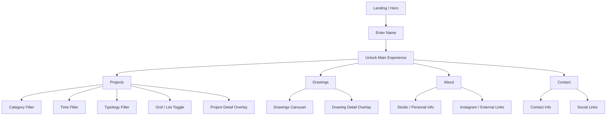
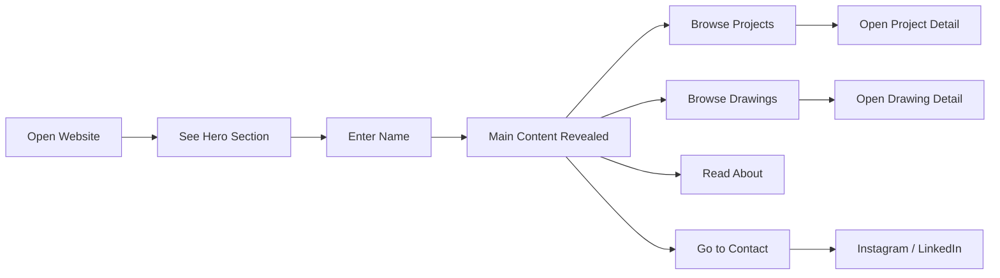
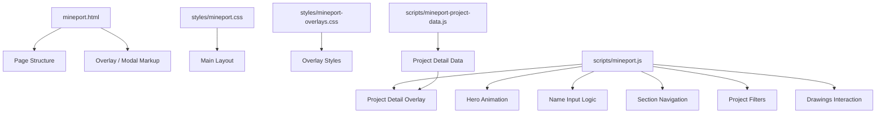

# Site Map

## Website Structure

```mermaid
flowchart TD
    A["Landing / Hero"] --> B["Enter Name"]
    B --> C["Unlock Main Experience"]

    C --> D["Projects"]
    C --> E["Drawings"]
    C --> F["About"]
    C --> G["Contact"]

    D --> D1["Category Filter"]
    D --> D2["Time Filter"]
    D --> D3["Typology Filter"]
    D --> D4["Grid / List Toggle"]
    D --> D5["Project Detail Overlay"]

    E --> E1["Drawings Carousel"]
    E --> E2["Drawing Detail Overlay"]

    F --> F1["Studio / Personal Info"]
    F --> F2["Instagram / External Links"]

    G --> G1["Contact Info"]
    G --> G2["Social Links"]
```

## User Flow

```mermaid
flowchart LR
    A["Open Website"] --> B["See Hero Section"]
    B --> C["Enter Name"]
    C --> D["Main Content Revealed"]
    D --> E["Browse Projects"]
    D --> F["Browse Drawings"]
    D --> G["Read About"]
    D --> H["Go to Contact"]

    E --> E1["Open Project Detail"]
    F --> F1["Open Drawing Detail"]
    H --> H1["Instagram / LinkedIn"]
```

## Code Structure

```mermaid
flowchart TD
    A["mineport.html"] --> B["Page Structure"]
    A --> C["Overlay / Modal Markup"]

    D["styles/mineport.css"] --> E["Main Layout"]
    F["styles/mineport-overlays.css"] --> G["Overlay Styles"]

    H["scripts/mineport.js"] --> I["Hero Animation"]
    H --> J["Name Input Logic"]
    H --> K["Section Navigation"]
    H --> L["Project Filters"]
    H --> M["Project Detail Overlay"]
    H --> N["Drawings Interaction"]

    O["scripts/mineport-project-data.js"] --> P["Project Detail Data"]
    P --> M
```
